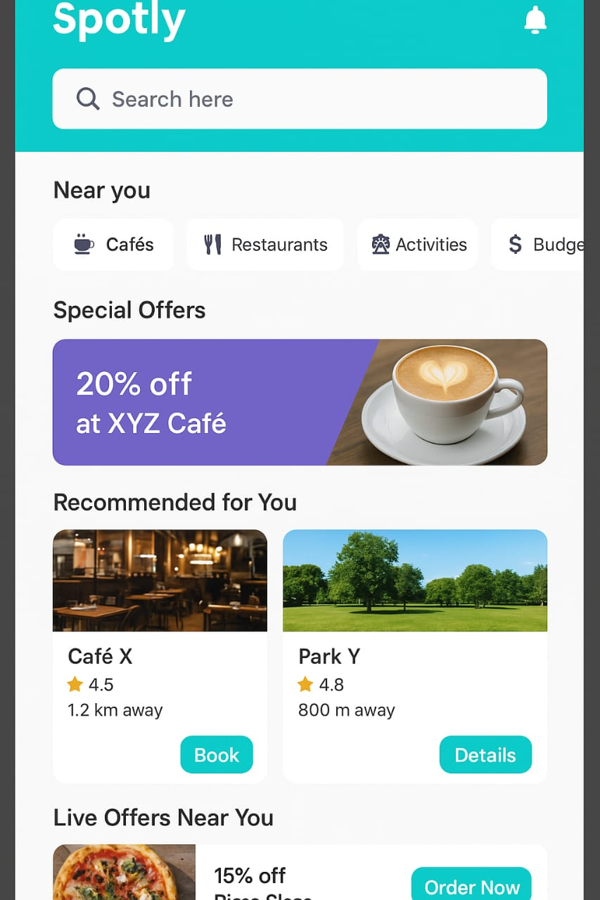

# Spotly App
Spotly is an Android application designed to help users discover unique spots and hidden gems around them. The app seamlessly integrates with Google Maps to provide the shortest routes, making exploration easier than ever.

## With Spotly, users can:
- Access place details: phone numbers, exact location, and official website/app links.
- Get Google Maps directions with the shortest routes.
- Browse menus & price lists for restaurants, cafés, or attractions.
- Unlock exclusive discount codes available only on the app.
- Leave ratings & reviews to guide other users.
- Save favorite spots for  quick access.
- Use smart filters to search by category (cafés, activities, budget-friendly, family-friendly, etc.).
- Discover community recommendations based on top-rated or most-visited places.
- Switch between multi-language support, making the app ideal for locals and tourists.
- Receive notifications about new offers, discounts, or nearby places.
- See live offers available at the moment they open the app.
- Reservation System 
    users can directly reserve a spot at restaurants, cafés, or activity places through the app by checking available time slots and confirming their booking.
- Ordering System for food & beverage spots, users can place orders via the app and choose between:
    - Take away (pick it up themselves).
    - Delivery (delivered to their address).
    - Dine-in (order in advance and have it ready when they arrive).
      
- Offers Integration users will automatically see if there are active offers when booking or ordering.
- Payment Gateway online payment options for reservations and orders, in addition to cash on delivery or in-store payment.

> Spotly isn’t just a discovery tool it’s a personalized guide that combines exploration, convenience, and savings all in one app.

  <h3>Home Page</h3>
  
 

